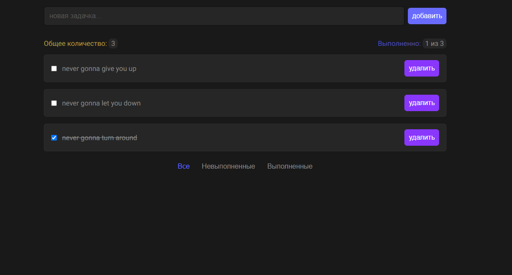

# Mindbox Frontend Test

### Table of Contents

- [Overview](#overview)
  - [The challenge](#the-challenge)
  - [Screenshot](#screenshot)
  - [Links](#links)
- [Development](#development)
  - [Built with](#built-with)
- [Author](#author)

## Overview

### The Challenge

Users should be able to:

- Add new items to the list
- Delete items from the list
- Delete all completed items at once
- Keep store of todos after closing browser or refreshing page
- Sort by status
- Delete all finished todos

Technical requirements:

- Project has to be written in React, using TypeScript and React Hooks

### Screenshot

### Links

[Live Website](https://davidbraginsky.github.io/mindbox_todo/)

## Development

### Built with

- React 18
- TypeScript 5
- Vite 
- Vitest

To deploy app locally download files manually or clone the repository. Install all dependencies using `npm install`. Once all dependencies have been installed deploy app using `npm run dev`.

### Todo

* [ ] make custom checkbox styles

* [ ] add animations

## Author

[@davidbraginsky](https://github.com/davidbraginsky)